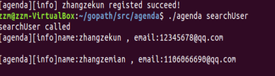

# 设计文档

## 1. 指令说明

#### （1）用户注册：./agenda register  -u=用户名 -p=密码 -e=邮箱 -t=电话

##### 注册的用户数据保存在user.json文件

####（2）用户登录：./agenda login -u=用户名 -p=密码

#####当前登录的用户名保存在current.txt文件中

#### （3）用户查询：./agenda searchUser

#### （4）创建会议：./agenda createMeeting -t=会议主题 -p=会议参与者 -s=开始时间 -e=结束时间

#####创建的会议保存到Meeting.json文件

#### （5）增删会议参与者：

#####             增：./agenda operateParticipant -t=会议主题 -o=add -p=参与者

#####             删： ./agenda operateParticipant -t=会议主题 -o=del -p=参与者 

####（6）查询会议：./agenda searchMeeting -s=查询的起始时间 -e=查询的结束时间

####（7）取消会议：./agenda cancelMeeting -t=会议主题

#### （8）退出会议：./agenda exitMeeting -t=会议主题

#### （9）清空会议

####（10）删除用户

